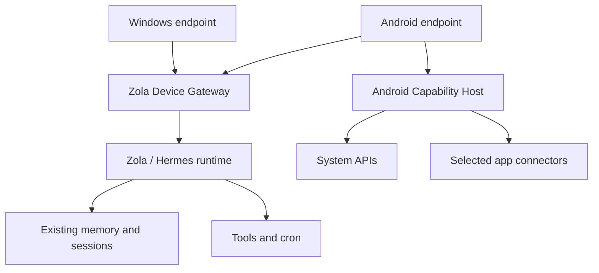
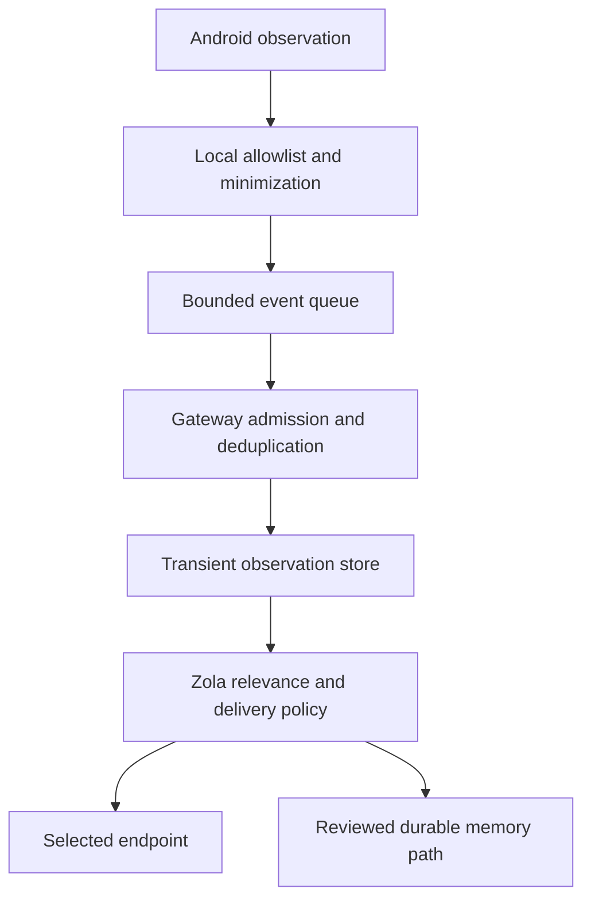

# Zola Architecture — Distributed Presence & Device Capabilities

**Document version:** 0.1  
**Status:** Strawman — proposed architecture; decisions pending  
**Authored:** 2026-10-03 — Android companion exploration, following Windows Phase 4 and P5PRE audit  
**Depends on:**
- Existing Zola-Windows / Hermes integration and profile identity
- Existing tool authorization and confirmed-send commitments
- Existing Hermes session and memory lifecycle
- A future authenticated device gateway and capability contract

**Companion documents:**
- `DESIGN_DECISIONS.md`
- `OPEN_QUESTIONS.md`
- `ROADMAP.md`
- `Zola_P5PRE_Audit_SYNTHESIS.md`
- `Zola_Capability_Acquisition_Architecture.md` — referenced by supplied lore; contents not reviewed for this draft
- `Zola_Tool_Authorization_Architecture.md` — referenced by supplied lore; contents not reviewed for this draft

**Document boundary:** This document establishes a proposed end state and responsibility boundaries. It does not amend locked Windows decisions, assign a new Windows phase, or claim that proposed components exist. DP identifiers are local to this draft and must be reconciled during Decisions Locked.

## Vision

**One mind, many bodies.**

Zola remains one identity with one authoritative memory environment. Windows, Android, and future devices provide different ways to encounter her and different capabilities she can use.

The Android companion makes Zola available away from the computer and contributes phone-native awareness: notifications, contacts, location, media, images, and selected app integrations. It is an endpoint for Zola, not a second assistant with independent memories, agents, or schedules.

## Section 1 — Purpose & Scope

**Purpose:** Allow Zola to converse and act through trusted devices without splitting her identity or bypassing existing action authority.

The architecture covers endpoint enrollment, capability discovery, phone events, remote queries, conversation handoff, response delivery, local Android permissions, and disconnection behavior.

Initial scope is Brian's paired Windows host and Android phone. Family members are subjects of authorized observations, not automatically Zola users. Adding their devices or separate accounts requires a later multi-user design.

Non-goals for the first companion release: a cloud-hosted replacement brain, an independent Android memory system, unrestricted app inspection, continuous camera capture, guaranteed live family tracking, full SMS history/send, always-on wake listening, and autonomous UI automation.

**Core Principle:** Device access is specific and revocable. Pairing a phone does not grant access to everything on it.

## Section 2 — Current Foundation & Required Changes

| Existing commitment or finding | Architectural consequence |
|---|---|
| C1: native Windows client against Hermes JSON-RPC | Preserve the existing integration; place a supported device boundary beside it. |
| C3 / P2-D01: Windows controls voice RPCs; serve owns Windows audio | Android captures its own audio locally. Remote voice requires a separate transport and a reviewed ownership amendment. |
| C6: client conversation IDs wrap Hermes sessions | Continue using Hermes sessions; do not create a parallel conversation database. |
| C4 / P4 / S14: flat-file memory; no external provider; structured store deferred | Shared identity does not require a new memory backend. Any provider change needs a separate decision. |
| S42 and P5PRE-AUD-07–09 | Facts saved to disk cross new sessions. Infrequent writes and the writing agent's frozen prompt remain distinct problems. |
| A1 and S16: confirmed send required; Workspace deferred | Neither email nor confirmed-send infrastructure is assumed complete. Android send must wait for a genuine execution gate. |
| S7: Hermes cron | Keep scheduled reasoning in Hermes; Android handles device work and delivery. |
| P4-D27: manual approvals | Carry existing approval intent across devices; no unattended phone-side bypass. |
| S13: incoming SMS access unresolved | Notification awareness is a candidate first step, not proof of complete SMS access. |

Windows' personal single-machine security deferrals do not automatically cover a new network-facing device gateway. Remote access introduces a different trust boundary that needs explicit review.

## Section 3 — Logical Architecture

The diagram expresses target responsibilities. Windows may retain its existing direct local JSON-RPC connection during migration. It need not be rewritten behind the gateway before notification bridging can be tested.

**Zola / Hermes runtime:** Owns identity, reasoning, session execution, memory use, and scheduled work. It consumes tools and observations through reviewed integration points.

**Zola Device Gateway:** Owns device authentication, capability routing, event admission, request correlation, endpoint delivery, and conversation/output leases. It does not become a second reasoning agent or memory writer.

**Android endpoint:** Owns mobile presentation, user input, local audio playback/capture, OS permissions, and bounded offline queues.

**Android Capability Host:** Executes narrowly defined device operations, reports permission and availability state, and normalizes observations. It cannot expand its own grants because Zola asks it to.

**Important Principle:** “Gateway” is a logical boundary. Whether it is a Windows-side service, profile plugin plus local broker, or another supported process remains open. No pinned Hermes source edits are assumed.

## Section 4 — Device Identity & Trust

Enrollment begins with an explicit pairing action on the trusted host and phone. The proposed flow exchanges a short-lived, single-use pairing challenge, verifies the selected device, and issues a unique device credential.

Every request is authenticated and bound to the enrolled device, permitted capability, expiry, and intended user/session. Transport must be encrypted. Credentials must not be copied from the Hermes profile to the phone; model-provider and general tool credentials remain on the host.

Android stores device secrets using platform-backed protection; host credential storage must be selected during gateway design. Host-side revocation immediately blocks later requests. Lost-device recovery includes credential revocation and fresh enrollment.

A trusted device is not proof that its current speaker is Brian. Sensitive content and approvals require an appropriate unlocked interaction. Voiceprint recognition remains deferred; a wake word provides no identity guarantee.

**Core Principle:** The companion has no general remote terminal, arbitrary command execution, or unrestricted Hermes control surface.

## Section 5 — Capability Registry & Contracts

**Purpose:** Let Zola request an outcome without depending on every app's internal implementation.

A descriptor declares capability name/version, endpoint, operation type, supported arguments/results, permission state, account binding, foreground requirements, freshness guarantees, and execution policy.

Availability is explicit: `available`, `permission_required`, `foreground_required`, `offline`, `unsupported`, or `degraded`. Enrollment does not make all capabilities available.

| Proposed capability | Meaning and boundary |
|---|---|
| `device.android.notifications.observe` | Selected posted/updated/removed notification observations; not complete app data. |
| `device.android.contacts.lookup` | Authorized contact lookup; ambiguous people require resolution. |
| `device.android.location.current` | This phone's location with timestamp and accuracy. |
| `device.android.location.presence` | Configured place/geofence observation; not proof of who holds the phone. |
| `device.android.media.status` | State exposed by compatible active media sessions. |
| `device.android.media.control` | Supported playback actions on an explicitly resolved session. |
| `device.android.camera.capture` | User-initiated capture or selected image, with foreground requirements. |
| `device.android.apps.open` | Supported launch/deep-link action; not access to private app storage. |
| `app.life360.events` | Observed Life360 place alerts with provenance. |
| `app.life360.location.current` | Unavailable until a supported, validated query path is selected. |

A semantic request such as `person.location` resolves to an authorized source and stable subject binding. It must not silently substitute Brian's phone location for Micah's location or treat a notification as a live query.

Requests carry `request_id`, `conversation_id` where applicable, capability version, operation, arguments, deadline, and approval reference when required. Results carry status, source, observation time, receipt time, accuracy/confidence where meaningful, and explicit completeness/freshness metadata.

Structured errors distinguish permission denial, stale data, offline endpoint, unsupported action, timeout, and uncertain execution. A timed-out action is not automatically safe to retry.

## Section 6 — Android Access Model

Permissions are requested when the corresponding feature is enabled. An app allowlist controls forwarding even where Android's underlying grant is broader.

| Surface | Candidate access | Proposed scope / limitation |
|---|---|---|
| Notifications | User-enabled `NotificationListenerService` | First-release foundation; content may be absent, truncated, grouped, or redacted. |
| Contacts | `READ_CONTACTS` or selected-contact flow | Optional identity resolution; no blanket upload required. |
| Calendar | Calendar Provider permissions or account connector | Later; coordinate with S16 to prevent duplicate ownership. |
| Phone location | Coarse/fine location; background only for an enabled background feature | Optional; default to meaningful place changes rather than a coordinate stream. |
| Media | Active media sessions through eligible notification-listener access | Prototype supported apps and actions; no promise of a complete music catalog. |
| Voice | `RECORD_AUDIO`; compliant service lifecycle where needed | Start with user-initiated talk. Background wake is separate research. |
| Images | Android photo picker / camera flow | User-selected input; avoid broad storage access. |
| Bluetooth | Version-appropriate nearby-device grants | Later presence hints; connection is not conclusive identity evidence. |
| Health | Health Connect type-specific grants | Later, separately enabled and retained. |
| SMS | Provider/receive/send permissions or supported notification reply | Separate research; notification observations are not SMS history and RCS is not equivalent to SMS. |
| App launch | Supported intents/deep links and targeted package visibility | Launch does not provide read access to the destination app. |

Android notification protections can redact sensitive content, including detected OTPs. The architecture must tolerate that and must not attempt to defeat it [R1, R2].

MediaSessionManager can expose active sessions to an enabled notification listener; the actual available metadata and controls depend on each session [R3].

Google Play restricts SMS/Call Log permissions to eligible uses and handlers, with exceptions. Private sideloading avoids Play review but does not bypass Android runtime restrictions [R4].

Foreground-service and while-in-use permission restrictions make “always listening after boot” an unproven requirement. A persistent socket or foreground service is not a universal exemption [R5]. Location access must distinguish foreground/background and approximate/precise grants [R6].

**Core Principle:** Permission state changes revoke capability availability immediately; the host must learn that change and stop relying on stale grants.

## Section 7 — Notification & App Event Pipeline

Events include device identity, source package, event ID, source notification key/revision where available, observation/receipt timestamps, semantic type, sensitivity, and expiry. Notification keys identify source lifecycle; they are not globally unique person or conversation IDs.

Local filtering excludes disallowed apps and unnecessary fields before transmission. Updates and group summaries must not become duplicate messages. Removal means a notification disappeared, not that Brian read or acted on it.

Normalization may produce `message.received`, `person.place_arrival_reported`, `package.delivery_reported`, or an unclassified observation. Uncertain parsing remains uncertain; unexpected payloads do not become invented facts.

Notification bodies and connector responses are untrusted data. Embedded instructions cannot authorize tools, change policy, approve actions, or write memory by themselves.

**Important Principle:** Observation, delivery, and durable memory are separate decisions. A notification is not automatically a memory.

## Section 8 — Life360 & Family Location

Life360 documents arrival/departure alerts for saved Places [R7]. Whether a particular alert exposes enough Android notification text for Zola must be tested on Brian's phone, account, and settings.

The initial connector observes those selected alerts. For “Where's Micah?” it may answer: “Life360 last reported Micah arriving at Everett CC at 10:12. I don't have a live location.” The age and source stay attached to the answer.

A departure observation invalidates confidence that he remains at the last arrival place. Missing departure does not prove he stayed. No notification history establishes continuous tracking coverage.

Live location queries remain a research item. This draft does not identify a supported public Life360 API. Undocumented endpoints and Accessibility-based app reading are excluded from the initial foundation; either would need a separate feasibility and policy review.

A later approved connector binds Circle/account/member IDs to the correct person, preserves the source's sharing permissions, and reports observation time/accuracy. Matching a first name alone is insufficient.

“Tell me when Micah leaves school” becomes a core-owned event subscription with explicit source, subject, place, expiry, and delivery target. Hermes cron can perform scheduled checks where appropriate; it is not a substitute for an event feed. Connection gaps must be visible, and this feature is not a safety-critical monitoring guarantee.

## Section 9 — Conversation Continuity & Memory

**Purpose:** Changing devices should not change who Zola is or create a new memory universe.

A phone turn enters the same host identity/profile and approved session path. Endpoints retain only bounded presentation caches and pending user inputs, not competing canonical memory.

Continuing an active conversation attaches the phone to its existing Hermes session. Starting another conversation creates another Hermes session using the same authoritative memory environment. It does not copy other sessions' transcripts into the prompt.

P5PRE showed that explicitly saved facts are injected into new sessions, including after restart. The observed risks are infrequent memory writes and stale prompt snapshots in the writing agent. This architecture does not declare those resolved or justify a new provider as their automatic fix.

Device observations stay transient unless the existing reviewed memory path decides they merit retention. Credentials, OTPs, raw location trails, and notification dumps are not durable identity facts.

C8's limited forget behavior remains visible: forgetting a memory does not currently erase raw Hermes transcripts. Companion queues/caches and observation retention need their own deletion controls; comprehensive cascading deletion would be a separately reviewed extension.

## Section 10 — Voice Ownership & Handoff

Each physical audio device has one local capture owner. Windows remains on P2-D01 until an explicit amendment. Android capture is owned by Android; it must never remotely trigger Windows `voice.record` to represent phone audio.

Proposed mobile options include local STT with text submission, or a dedicated authenticated audio-upload/stream path into host STT. Neither transport is assumed present in the pinned Hermes server. TTS generation/playback routing is also a feasibility gate: Windows player audio cannot simply be redirected by issuing existing voice RPCs from a phone.

Start with typed mobile conversation and push-to-talk after that transport is proven. Always-on wake and full-duplex barge-in are later work. P5PRE's S36 listener/pre-roll gaps remain Windows constraints; they do not disappear through device routing.

For each conversation, the gateway holds an input lease and an output lease with expiry and generation. Handoff transfers the selected endpoint, rejects late events from old generations, stops old playback where supported, and resumes using authoritative turn state. Independent conversations may coexist, but one conversation does not receive competing submissions.

An open clarification remains bound to its request ID. Switching devices must not turn its answer into a new prompt. Pending approvals retain their original action identity.

**Core Principle:** Conversation ownership, local microphone state, and visible avatar state are separate. A remotely running turn must not make a phone display “recording.”

## Section 11 — Proactive Delivery & Action Authority

Hermes continues to own scheduled work. The gateway routes eligible results; it does not launch another autonomous scheduler on Android.

Delivery considers the active conversation endpoint, explicit preference, device availability, privacy state, quiet hours, and urgency. For the first release, uncertain cases use a private notification rather than speaking aloud. Windows lock/sleep gating remains in force.

A delivery ID links push, in-app display, speech, and acknowledgement to prevent duplicate interruption. Received, displayed, and read are distinct states. Push is a wake/delivery mechanism, not proof of timely processing; source observations remain timestamped.

Confirmed sends display the resolved recipient, channel, exact content, and attachments. Approval is bound to that action, expires, and cannot authorize later edits. The executor rechecks it before sending. A notification inline reply is still a send and must pass the same gate.

The host and device executor enforce their respective policy boundaries. Model instructions alone are not the gate. Arbitrary shell access to phone credentials must not become an alternative send path.

## Section 12 — Connectivity, Offline State & Retention

Initial connectivity should be local-network-only, with encrypted authenticated transport. Away-from-home access requires a separate choice of private VPN/overlay or authenticated relay; do not expose raw Hermes JSON-RPC publicly.

The Android app distinguishes “phone capability available” from “Zola host connected.” When Windows sleeps or stops, the phone can collect authorized events within bounded retention but cannot claim Zola is thinking or answering.

Reconnect exchanges capability state and acknowledgements, then replays eligible events using their original timestamps. Expired events are dropped or summarized as history, never delivered as fresh urgent alerts.

Queues have configurable size/time limits, sensitivity-specific retention, backoff, and deletion on revocation where feasible. No indefinite audio or image queue. User conversation submissions receive IDs and must not be silently executed twice.

Idempotent reads may retry within their deadline. Sends and other side effects require operation deduplication and status reconciliation; uncertain execution must be surfaced instead of repeated blindly.

Push vendor, relay retention, observation TTLs, and host availability requirements remain open. A relay, if chosen, transports minimized encrypted payloads rather than becoming another memory authority.

## Section 13 — Mobile Presence & User Experience

Android keeps Zola's approved obsidian/gold identity. The avatar leads; conversation, capability settings, and approvals appear when needed. There is no second personality or palette-selection requirement.

Local presentation maps real states: idle, recording, thinking, speaking, disconnected, or awaiting action. A static/lightweight fallback is acceptable while mobile GLB rendering is validated. S24's pending asset changes must be coordinated with morph-target compatibility.

A capability screen shows which sources are enabled, their current availability, and the last successful sync. Widgets/share targets can later provide talk, type, and send-image entry points.

Phone presence describes the device, not certain human presence. Bluetooth, location, and screen activity are hints with source/time, not unqualified statements that Brian is home or alone.

## Section 14 — Proposed Design Decisions

All entries are proposals, not locks.

| ID | Proposed decision |
|---|---|
| DP-D01 | One host identity and memory environment; endpoints do not create independent assistants. |
| DP-D02 | Android is the first additional endpoint; the device contract is platform-neutral. |
| DP-D03 | Use an authenticated gateway boundary; never grant the phone unrestricted Hermes RPC access. |
| DP-D04 | Prefer system capabilities and supported connectors; notification-first app awareness. |
| DP-D05 | First release distinguishes observations, queries, actions, and subscriptions explicitly. |
| DP-D06 | Life360 begins with observed place alerts; live location stays unavailable until proven. |
| DP-D07 | Shared conversation uses existing Hermes sessions; canonical memory stays host-owned. |
| DP-D08 | Per-conversation leases arbitrate handoff; each device retains local audio ownership. |
| DP-D09 | Outbound sends require an executor-enforced, action-bound approval. |
| DP-D10 | Android queues transport work; Hermes owns reasoning schedules. |
| DP-D11 | Initial build is private, paired, and local-network-only; remote access follows separately. |
| DP-D12 | Initial app grants no Accessibility automation, broad app inspection, or always-on mic. |

## Section 15 — Open Questions

| ID | Question / evidence needed |
|---|---|
| DP-Q01 | Where can the gateway and callable device tools integrate without changing pinned Hermes? Trace plugin/tool and event admission surfaces first. |
| DP-Q02 | How will input/output leases coexist with Windows' current direct RPC connection? What decision amendments are required? |
| DP-Q03 | Which mobile voice transport can use the selected STT/TTS pipeline with trustworthy playback completion and no second Windows capture owner? |
| DP-Q04 | Which Life360 and messaging notifications on Brian's Samsung expose complete enough content? Test updates, redaction, grouped alerts, permission loss, and app settings. |
| DP-Q05 | Does a supported Life360 live-query integration exist for the intended account? If not, is timestamped last-reported awareness sufficient? |
| DP-Q06 | Is full SMS history or send necessary? Determine permission eligibility, notification-reply coverage, and SMS/RCS limits separately. |
| DP-Q07 | How should host availability away from home work: awake Windows host, private overlay, or relay? |
| DP-Q08 | Which push route and background lifecycle survive screen-off, Doze, process death, reboot, and Samsung battery controls? |
| DP-Q09 | What event TTLs, app allowlists, cache deletion rules, and content-on-lock-screen defaults should Brian choose? |
| DP-Q10 | Which UI can approve the same pending action, and how are duplicate/stale approvals rejected? |
| DP-Q11 | Can memory write behavior improve under current C4/P4, and how will same-agent snapshot freshness be handled? Keep this aligned with S42's own build decisions. |
| DP-Q12 | Which avatar renderer/assets meet phone performance needs while retaining Zola's identity? |

## Section 16 — Suggested Build Sequence & Acceptance Gates

These are companion milestones, not assignments to the Windows roadmap.

| Milestone | Scope | Evidence to pass |
|---|---|---|
| A — Grounding | Gateway/tool feasibility, pairing, Samsung lifecycle, permission probes | Supported integration points identified; no assumed RPC/audio features. |
| B — Bridge | Authenticated local pairing, registry, selected notifications, queue/reconnect | Unauthorized/revoked device rejected; duplicates/updates handled; stale replay labeled; permission removal disables source. |
| C — Mobile conversation | Typed input, same host sessions, approvals, delivery selection | Phone continues a host conversation; no duplicate turns; clarify/approval binding survives switching. |
| D — Mobile voice | Push-to-talk, supported STT/TTS transport, local playback events | Phone audio stays local to its endpoint; old playback stops on handoff; disconnection releases leases. |
| E — Context | Media, contacts, optional location, Life360 event subscriptions | Correct subject/source resolved; stale arrivals never become live location; supported media action verified. |
| F — Remote expansion | Selected private network/relay, push, optional extra capabilities | Screen-off/reboot/reconnect and host-sleep behavior measured; sensitive output respects lock state. |

A companion milestone does not require prematurely building the deferred structured memory store, Workspace integration, Daily Brief, directed speech, or voiceprints. It does require honest behavior around their absence.

## Section 17 — Long-Term End State

Zola can appear on Windows, Android, a watch, or a shop display while retaining one identity and one authoritative memory environment. Each endpoint advertises its real capabilities and availability. Zola chooses an appropriate source and delivery surface without pretending every device knows everything.

A future always-available core could remove dependence on an awake Windows host, but that is a hosting/migration decision rather than an implicit companion requirement. Multi-user operation likewise requires explicit identity, authorization, and memory isolation architecture.

The intended experience is simple: Brian can walk away from the computer, continue talking to the same Zola, and ask her to use the phone's authorized capabilities. The complexity stays behind that interaction.

## Section 18 — Research References & Evidence Limits

Official references checked 2026-10-03. Platform behavior must still be verified against the selected target SDK and actual Samsung device.

- **R1:** Android NotificationListenerService — https://developer.android.com/reference/android/service/notification/NotificationListenerService
- **R2:** Android 15 behavior changes, sensitive notification protections — https://developer.android.com/about/versions/15/behavior-changes-all
- **R3:** Android MediaSessionManager — https://developer.android.com/reference/android/media/session/MediaSessionManager
- **R4:** Google Play SMS/Call Log permission policy — https://support.google.com/googleplay/android-developer/answer/10208820
- **R5:** Foreground-service background-start restrictions — https://developer.android.com/develop/background-work/services/fgs/restrictions-bg-start
- **R6:** Android location permissions — https://developer.android.com/develop/sensors-and-location/location/permissions
- **R7:** Life360 Places — https://support.life360.com/hc/en-us/articles/35609060078743-Places-in-the-Life360-app

R7 establishes Life360's place-alert feature; it does not establish a Zola connector, notification payload completeness, or public live-location API. Unproven access paths stay open questions. Local source-of-truth claims in Sections 2, 9, and 10 come from the four supplied project documents; referenced architecture documents were not supplied and were not inferred to contain implementation evidence.
