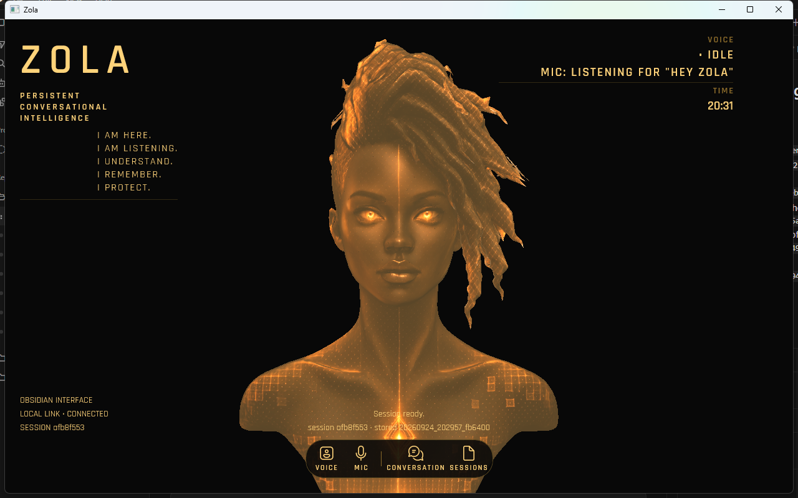

# P3-RENDER Progress — 3D Presence

## Branch

- Branch: `p3-render-presence`
- Base SHA: `eba07383ab752bb0e7a4e75d6eeea10636ff7de3` (plan v1.3 commit; branch point)
- Plan v1.3 commit SHA: `eba07383ab752bb0e7a4e75d6eeea10636ff7de3`
- Recorded HEAD before the plan commit: `5ba654783e6949267b9785a11b10c9bd17bb1719` (`docs: record P3-SHELL merge SHA`), a direct successor of P3-SHELL merge `b8bf6a15c8b806bca0fea499dbcfce0535e92932`
- Plan source SHA-256: `3574bf92f2aa6da94be31948c9d1faf1e4d02331efaa1d68b29885228d974ec6` (matched)
- Prompt: P3-RENDER v1.1

## Phase status

| Phase | Name | Status |
|---|---|---|
| 1 | Plan v1.3, Branch, and Progress Document | COMPLETE |
| 2 | Read and Understand | COMPLETE |
| 3 | Build: Packages, Asset, and Presence Scaffolding | COMPLETE |
| 4 | Build: PresenceView and Wiring | COMPLETE |
| 5 | Smoke Test | COMPLETE |
| 6 | Closeout | COMPLETE |

## Guardrails summary

- **G-SCOPE:** Helix packages, `Assets/Presence/zola.glb`, `Presence/*`, `MainWindow.xaml.cs` host/pause/dispose/debug accelerators only, optional one token style, plan v1.3, and this progress document. No `MainWindow.xaml`, no `ZolaDisplayState`, no RPCs, no animation, no `PresenceMode`.
- **G-ARCH:** The build plan is truth. A conflict that affects a task is a stop.
- **G-PATTERN:** Read every relevant file in full before changing it.
- **G-NOCHANGE:** Every Track 2 behaviour must still work. Do not touch files outside the current task.
- **G-COMMENT:** One `// P3-RENDER: … — P3-D0X` per logically distinct changed block.
- **G-STOP:** Stop after each phase and wait for that phase's exact proceed message.
- **G-CLOSEOUT:** Closeout begins only on "proceed to closeout".
- **G-LORE-SCOPE:** `ROADMAP.md`, `DESIGN_DECISIONS.md`, and `OPEN_QUESTIONS.md` are out of scope, including closeout.
- **G-SPIKE:** Spike at `C:\Users\test\Dev\zola-spikes\p3pre-helix\` is reference only. Do not copy files or paste large blocks.
- **G-NO-CROSS-SCOPE:** Android Zola and Ava are out of scope.
- **G-TOKENS:** Viewport background from `ZolaBackground`. Camera, light, environment, and material values are named constants in `PresenceView.cs`.
- **G-THREAD:** Import and texture decode off the UI thread. Scene attach and scene-graph changes on the UI thread.
- **G-FAILCLOSED:** Presence failure never takes down voice, chat, or the HUD. Never drive the wrong morphs. Never leave a frozen half-scene.
- **G-DEPS:** Only the two Helix 3.1.2 add commands and the one GLB copy.

## Packages

`dotnet list package` before G-DEPS:

```
Microsoft.Windows.SDK.BuildTools      10.0.26100.4654   10.0.26100.4654
Microsoft.WindowsAppSDK               2.5.1             2.5.1
System.Management                     9.0.4             9.0.4
```

`dotnet add package HelixToolkit.WinUI.SharpDX --version 3.1.2`: restored, no `NU1xxx`.
`dotnet add package HelixToolkit.SharpDX.Assimp --version 3.1.2`: restored, no `NU1xxx`.

`dotnet list package` after G-DEPS:

```
HelixToolkit.SharpDX.Assimp           3.1.2             3.1.2
HelixToolkit.WinUI.SharpDX            3.1.2             3.1.2
Microsoft.Windows.SDK.BuildTools      10.0.26100.4654   10.0.26100.4654
Microsoft.WindowsAppSDK               2.5.1             2.5.1
System.Management                     9.0.4             9.0.4
```

App SDK unchanged. Direct packages are the three before plus the two Helix packages.

## GLB check

Canonical source: `C:\Users\test\Dev\zola-assets\zola.glb`.
Copied to `windows-client/Zola.Client/Assets/Presence/zola.glb`.
SHA-256 `1edf2bf5898528fd405cd3131fcf75548c6d5d1e893501467c65845b5d7a054b` (matched).
Size 33,972,240 bytes (matched).
Same hash and size in the win-x64 output `Assets\Presence\` folder.

## Phase 3 build

`Presence/MorphTarget.cs`: K3 enum `BlinkLeft` … `TeethFV`, `MorphTargets.MorphTargetCount = 15`.
`Presence/GlbTextureLocator.cs`: defensive GLB header/chunk/index checks; JSON walk to `Image_1` bytes.
`Presence/SessionLockWatcher.cs`: P/Invoke subclass; callback stored in a field; `Dispose` removes the subclass and unregisters WTS before the window is destroyed. Not wired.
`Zola.Client.csproj`: two Helix 3.1.2 references plus the GLB `Content` item.

`dotnet build … -r win-x64`: 0 warnings. Launched once (pid 15140). Nothing is hosted in `PresenceHost`, so the window is still the Track 2 shell.

## Phase 2 findings

### 1. Spike map

Source: `C:\Users\test\Dev\zola-spikes\p3pre-helix\` (`MainWindow.xaml.cs`, `MainWindow.Lab.cs`). Not copied.

**Viewport and effects manager** — `MainWindow` ctor, after `InitializeComponent`. `new Viewport3DX` in code (XAML declaration crashed `0xc000027b`). `EffectsManager = new DefaultEffectsManager()`. Added to `Stage.Children`. Closed handler disposes the effects manager.

**Import** — `OnActivated` (first activation) calls `LoadModel()` on the UI thread. `using var importer = new Importer(); scene = importer.Load(absolutePath)`. Cold 769 ms, warm 322 ms (`spike-run.log`). Root is `GroupNode` → `BoneSkinMeshNode` with 15 weights. Material is `PhongMaterialCore`.

**PBR material and `Image_1`** — `LightingPbrAsync` / `LoadMetallicRoughnessAsync`. Builds `PBRMaterialCore` from Phong `DiffuseMap` / `NormalMap` / `EmissiveMap`. `Image_1` was sliced with a **hard-coded** file offset (`10_564 + 12_022_224`, length `1_490_005`) and `new TextureModel(MemoryStream, false)`. Plan / `P3-D02` require a GLB JSON walk, never that offset. `RenderAmbientOcclusionMap = false`. L8+ sets `RenderEnvironmentMap = true`.

**Environment cube** — `ApplyL1`: in-memory 16×16 DDS cube (`WarmCubeDds`), warm vertical gradient (`r = 80+140t`, `g = 40+70t`, `b = 10+face*4`). `EnvironmentMap3D.Texture` + `SkipRendering = true`.

**Lights and camera** — ctor camera matches Grounding. L9 lights applied later in the lab, not at construct.

**Morphs** — `_morph.SetWeight(index, w)` then `_morph.WeightUpdated()`. Names are a local string array, not imported.

**Spike constants vs Grounding**

| Constant | Spike | Plan Grounding | Match |
|---|---|---|---|
| Camera position | `(0, 0.05, 3.15)` | same | yes |
| Look direction | `(0, 0, −3.372)` | same | yes |
| FOV | 35 | 35 | yes |
| Up | `(0, 1, 0)` | (implied) | yes |
| Ambient L9 | `#FF5A4628` (90,70,40) | `#FF5A4628` | yes |
| Key L9 | `#FFFFDCAA` at `(−0.3, −0.8, −1)` | same | yes |
| Fill L9 | `(180,120,60)` at `(0.6, −0.2, −0.5)` | same | yes |
| Background | `#FF080808` literal | `ZolaBackground` token `#080808` | plan wins |
| `RenderAmbientOcclusionMap` | false | false | yes |
| FXAA | `FXAALevel.None` | default (Phase 4) | plan wins |
| MSAA | `MSAALevel.Disable` | not specified | leave default |
| `Image_1` locate | hard-coded byte offset | GLB JSON walk | plan wins |

Spike extras not in the plan (not copied): `CameraMode.Inspect`, `UseDefaultGestures = false`, view-cube/coordinate gizmos off, initial grey ambient + white key before L9.

### 2. Threading (G-THREAD)

Spike imported on the **UI thread** (`OnActivated` → `LoadModel`, no `Task.Run`).

Helix XML (`HelixToolkit.SharpDX.Assimp` 3.1.2): `Importer.Load(string)` has no UI-thread or STA requirement. `ImporterConfiguration.EnableParallelProcessing` exists for mesh conversion. `TextureModel(Stream, bool)` is a byte wrapper; device views are created later on attach.

Plan: `Task.Run` for `Importer.Load`, `GlbTextureLocator`, and JPEG decode. `DispatcherQueue` for finding `BoneSkinMeshNode`, building `PBRMaterialCore`, assigning material, adding lights / env, and attaching the scene. Off-thread import is safe. Not BLOCKED.

### 3. Pause mechanism (KC7)

Helix 3.1.2 `IRenderHost` (via `Viewport3DX.RenderHost`):

- `IsRendering` get/set — stops the render loop without tearing down D3D.
- `StopRendering()` / `StartRendering()`.
- `EndD3D()` / `StartD3D()` tear the device down (too much for minimize).

**Choice:** `RenderHost.IsRendering = false` to pause, `true` plus `InvalidateRender()` to resume. Keeps the last frame and does not call `InvalidateScene()`. Hiding the viewport is allowed but would blank the host; the flag does not.

### 4. Device loss (KC6)

Helix exposes:

- `Viewport3DX.RenderExceptionOccurred` / `IRenderHost.ExceptionOccurred`
- `IEffectsManager.DisposeAllResources` / `Reinitialize` (“DeviceLost or DeviceRemoved”)
- `DX11RenderBufferProxyBase.DeviceLost` (internal buffer)

No public “device is alive” bool. Re-validation after unlock/resume: resume rendering, `InvalidateRender()`, wait for one `OnRendered`. If `RenderExceptionOccurred` fires, `Device` is null, or no 3D frame arrives, call `InvalidateScene()` + `LoadAsync()` and log `P3-RENDER: device recovered`. If `OnRendered` fires, log `scene reused`.

`Viewport3DX.OnRendered` is Helix finishing a GPU frame, not a compositor present. Log it as “first 3D frame (Helix `OnRendered`)”, not a displayed frame.

### 5. Lock and power notifications

`Microsoft.Win32.SystemEvents` is **not** available without a new package. The project is WinUI (`UseWinUI`), not WPF/WinForms; it does not reference `Microsoft.WindowsDesktop.App` or `Microsoft.Win32.SystemEvents`. Current packages: Windows App SDK 2.5.1, SDK BuildTools, System.Management 9.0.4.

**Route:** P/Invoke (plan v1.3).

- HWND: `WinRT.Interop.WindowNative.GetWindowHandle(window)`
- `wtsapi32!WTSRegisterSessionNotification(hwnd, NOTIFY_FOR_THIS_SESSION)` / `WTSUnRegisterSessionNotification`
- `comctl32!SetWindowSubclass` / `RemoveWindowSubclass` / `DefSubclassProc`
- `WM_WTSSESSION_CHANGE` (0x02B1): `WTS_SESSION_LOCK` 0x7 → `Locked`; `WTS_SESSION_UNLOCK` 0x8 → `Unlocked`
- `WM_POWERBROADCAST` (0x0218): `PBT_APMSUSPEND` 0x4 → `Suspending`; `PBT_APMRESUMESUSPEND` 0x7 / `PBT_APMRESUMEAUTOMATIC` 0x12 → `Resumed`

Unregister and remove the subclass on window close.

### 6. Wiring points in `MainWindow.xaml.cs`

| What | Where |
|---|---|
| Create `PresenceView`, add as only child of `PresenceHost` | ctor after `InitializeComponent()` (line 65); `PresenceHost` exists from XAML |
| Log “root loaded”; subscribe one `CompositionTarget.Rendering` | `OnRootLoaded` (958–962). First tick: unsubscribe, log “render opportunity”, start `LoadAsync()` |
| Pause / resume (minimize, visibility) | New `AppWindow.Changed` (presenter minimized) and `Window.VisibilityChanged`, next to `SizeChanged` (67) |
| Lock / power | `SessionLockWatcher` created after HWND is valid (ctor or `OnRootLoaded`); events → pause / resume+revalidate |
| Dispose | existing `Closed` handler (92–102): stop watcher, then `_presence.Dispose()`, then today’s dispose |
| `#if DEBUG` accelerators | `RootGrid.KeyboardAccelerators` after `InitializeComponent`; `Ctrl+Shift+F9/F10/F11`. Does not collide with `Ctrl+Space` or Esc (16–19 in XAML) |

### 7. Fallback style (KC9)

`ZolaSectionHeaderStyle` — muted amber, 14 px, SemiBold, same style as CONVERSATION / SESSIONS headers. `ZolaRightHeaderStyle` is the other muted header; the section style is the better centred line. No new token style.

### 8. Flags or blockers

- **Not BLOCKED.** Off-thread import is safe.
- Track 3 prose still says `ms-appx`-resolved GLB; Phase 4 and the unpackaged `Content` item use `Path.Combine(AppContext.BaseDirectory, "Assets", "Presence", "zola.glb")`. Follow Phase 4.
- Track 3 `SetWeight` wording (“once per frame”) vs KC5 (`ApplyWeights()` only if something changed). Follow KC5.
- Spike `FXAALevel.None` and MSAA off vs “FXAA stays at its default”. Plan wins.
- Spike `Image_1` byte offset is forbidden. `GlbTextureLocator` walks JSON.
- `ROADMAP.md` still says Phase 3 is not started. G-LORE-SCOPE: no edit.
- `DESIGN_DECISIONS.md` has no `P3-D*` rows yet (lore closeout after all five tracks).
- Load start signal: first `CompositionTarget.Rendering` after `RootGrid.Loaded`. That is a **render opportunity**, not a displayed frame. Helix `OnRendered` after attach is the first 3D-frame signal.

## Phase 4 additions (recorded in Phase 3)

Developer additions for Phase 4, recorded now:

- **Re-validation timeout (KC6).** After unlock or resume, waiting for `OnRendered` has a limit: a named constant of about 5 s. The clock runs only while the window is visible and not minimized; if it is hidden, the wait pauses until the window is shown. If the limit passes with no frame and no `RenderExceptionOccurred`, treat it as failed validation: one `InvalidateScene()` + `LoadAsync()`, logged `reload (no frame after resume)`. A frame in time logs `scene reused`.
- **Callback lifetime (`SessionLockWatcher`).** Store the `SetWindowSubclass` callback delegate in a field for the watcher's whole lifetime so the GC cannot collect it. On window close, call `RemoveWindowSubclass` and `WTSUnRegisterSessionNotification` before the window is destroyed. Handle `WM_POWERBROADCAST` `PBT_APMSUSPEND` (→ `Suspending`) and `PBT_APMRESUMEAUTOMATIC` (→ `Resumed`), and pass every message through `DefSubclassProc`.
- **`WM_NCDESTROY` (0x0082).** When it arrives, run the same unhook as `Dispose` (once), then `DefSubclassProc`, so the hook cannot outlive the window if `Closed` does not run.

## Phase 4 build

`PresenceView` is a code-built `UserControl`. Viewport and `DefaultEffectsManager` are constructed in code. `BackgroundColor` is the `ZolaBackground` token. Camera and L9 lights are named constants. FXAA is left at default. Fallback is `ZolaSectionHeaderStyle` on `ZolaBackgroundBrush`.

`LoadAsync` follows KC4. Import and `GlbTextureLocator` run on a worker; attach is on the UI thread. Importer applies the glTF node translation `(-1.752, 0, 0)`; Grounding frames the bust at the origin, so `root.ModelMatrix` is set to identity before attach (`P3PRE-AUD-20`).

KC3 log (latest cold launch, pid 14716):

```
18:10:45.072 root loaded
18:10:45.157 render opportunity
18:10:45.158 import started
18:10:46.135 scene attached (UI thread)
18:10:46.141 load duration=823ms workingSetBefore=210362368 workingSetAfter=836194304 (200 MB → 797 MB)
18:10:46.155 first 3D frame (Helix OnRendered)
```

Async continuations that check disposed + generation (KC10):
- after `Task.Run` import returns
- the UI-thread attach enqueue
- each poll of `RevalidateAfterResumeAsync`
- after that wait ends, before `InvalidateScene` / `LoadAsync`

`InvalidateScene()` call sites: debug reload (`Ctrl+Shift+F10`); re-validation on `RenderExceptionOccurred`; re-validation timeout (`reload (no frame after resume)`). Minimize / visibility / lock / suspend only pause.

Searches: `Viewport3DX` only in `PresenceView.cs`; no `#RRGGBB` in `Presence/`; `SetWeight` / `WeightUpdated` only in `PresenceView`; `MainWindow.xaml` `git diff` empty.

`dotnet build … -r win-x64` 0 warnings.

Pre-smoke Track 3 fix: Helix viewport chrome and camera control are off. Presence is a fixed view. Every chrome and gesture property is a named constant set to `false` (empty title and sub-title), assigned explicitly on `Viewport3DX` (`P3-D11`). `InputBindings` is cleared so default mouse and keyboard gestures are not bound.

Camera confirmation: left-drag, right-drag, wheel in/out, and double-click on the bust. Before and after shots match pose and framing (sampled pixel delta 0.32%, clock and overlay only). No view cube, coordinate axes, frame-rate, camera info, or title. After a click on the bust, Ctrl+Space still toggles voice (`display-state.log`: `Wake listening paused`, then a later toggle returned to `Mic: listening for "Hey Zola"`).



## Carried to P3-LOOK

Developer requests recorded only. Not implemented in this track:

- Tune colouring.
- Hide the dock until mouse-over (details decided in P3-LOOK).
- Remove "Session ready" and the session/stored notice from over the bust (details decided in P3-LOOK).
- Revisit memory after reloads alongside the texture-size test, including whether explicit scene disposal is worth adding.

## Smoke test

Scripts in `%TEMP%\p3render-smoke\` (outside the repo). Cold launch pid 13724, then fallback relaunch pid 19276. Client left at 1280×800 Voice mode.

### Part A

| # | Result | Evidence |
|---|---|---|
| A1 | PASS | HUD first: `display-state` `07:24:56.349` Dormant, then Idle, before first 3D frame `07:24:58.330`. Presence: root loaded → render opportunity → import started → scene attached → load **1067 ms** (202→789 MB) → first 3D frame. `P3-RENDER_smoke_A1.png`. |
| A2 | PASS | Face fully visible and centred at 900×640 and 1280×800. The first `P3-RENDER_smoke_A2_maximized.png` was 1280×800 (capture restored the window). Replaced: maximize, wait 2 s, `GetWindowRect` **1936×1048** at 1912,12 on the right monitor (1920×1080 at 1920,20). File is **1936×1048** (matches the window). Face centred, extra side space. Looked at. |
| A3 | PASS | Overlay draws over the bust; dock stays uncovered at 1280 and 900. `P3-RENDER_smoke_A3_1280x800.png`, `P3-RENDER_smoke_A3_900x640.png`. |
| A4 | PASS | `07:25:37.364` debug blink on (eyes closed); `07:25:38.373` debug blink off (eyes open). `P3-RENDER_smoke_A4_blink_on.png`, `P3-RENDER_smoke_A4_blink_off.png`. |
| A5 | PASS | One `Ctrl+Shift+F10`: one `import started` and one `load coalesced` at `07:25:40`, then first 3D frame. `P3-RENDER_smoke_A5_after_reload.png`. |
| A6 | PASS | Cold load working set **202 MB → 789 MB**. Spike `P3PRE-AUD-24` baseline 671 MB. Reload peak in A5 was 838→1109 MB (warm). |
| A7 | PASS | Adapter Intel Iris Xe (+ DisplayLink). `GPU Engine(pid_13724*)\Utilization Percentage`, 26 instances (Iris `luid_…1355F` 3D/Copy/VideoDecode/… plus DisplayLink `luid_…1390B` 3D engines), 1 s interval, sum of pid instances per sample, 60 s. **avg 0.0010%, max 0.0602%**. |
| A7b | PASS | Same method, 30 s after A5 reload. **avg 0.0020%, max 0.0597%**. |
| A8 | PASS | Bust click then Ctrl+Space: `07:28:31.262` `voice="Listening" mode=Listening`. Composer focused: `07:28:39.297` Listening again. |
| A9 | PASS | `07:28:56` paused (minimized/hidden); `07:29:28` resumed. GPU while minimized avg **0.0003%** max 0.0081%. Bust renders after restore. `P3-RENDER_smoke_A9_restored.png`. |
| A10 | PASS | Text-mode short turn → Idle, composer focus returned. Long turn Cancel → `Interrupted.` New session `08a745d3`, resume stored `20260925_072457_80c9b7` → session `53f4ede2` with prior You/Zola turns. `P3-RENDER_smoke_A10.png`. |
| A11 | PASS | Output GLB renamed: UIA `PRESENCE UNAVAILABLE`; log `presence unavailable — GLB missing`. HUD live; typed turn completed; Ctrl+Space `07:35:14.898` Listening. Restored name, relaunch first 3D frame 756 ms. `P3-RENDER_smoke_A11_fallback.png`, `P3-RENDER_smoke_A11_restored.png`. |
| A12 | PASS | 16 `Ctrl+Shift+F11` log lines 0–14 plus Neutral. Crops: BlinkLeft/Right/Both, Squint, WideAlert, BrowRaise/Furrow, NostrilFlare, JawOpen, OpenAH, MidOpenEhUh, ClosedMBP, RoundOOW, WideEE, TeethFV, Neutral. `P3-RENDER_smoke_A12_morph_00.png` … `A12_morph_15_neutral.png`. Part B confirmed identity. |
| A13 | PASS | During Thinking, `Ctrl+Shift+F10` at `07:34:00` (import + coalesced + first 3D frame). Turn finished Idle; session still `53f4ede2`; voice still Text mode; composer focused; lighthouse reply visible. `P3-RENDER_smoke_A13.png`. |

### Part B

Developer: `smoke test passed` (2026-09-25).

| # | Result | Evidence |
|---|---|---|
| B1 Looks like L9 | PASS | Developer. |
| B2 Morph identity | PASS | Developer, against the 16 A12 crops. |
| B3 Lock | PASS | `presence.log`: `07:51:44.233` `paused (locked)`; `07:55:31.097` `resumed (locked)`; `07:55:31.533` `scene reused`. After unlock, voice: `07:55:54` Listening → Thinking → Speaking. |
| B4 Sleep | PASS (developer) | No `paused (suspended)` / `resumed (suspended)` pair in `presence.log`. Developer confirmed the bust rendered after wake. |
| B5 Voice run-through | PASS | `display-state.log` `07:55:54`–`08:01:42`: wake/answer, barge-in, follow-up (Listening → Thinking → Speaking, repeated). |
| B6 Relaunch | PASS | `08:02:29.108` root loaded; `08:02:30.509` first 3D frame; load 1084 ms (202→790 MB). |

**Result:** `smoke test passed`. No crash, no frozen presence, no Phase 2 regression. Lock recovered without reload. Sleep wake was developer-checked; the process did not log a suspend/resume pair.

## Pre-closeout checks

**A2 maximized (replaced).** `GetWindowRect` after maximize + 2 s: 1912,12 **1936×1048**, on the right-hand 1920×1080 monitor. PNG **1936×1048**, matches the window. Face centred and fully visible; more side space than the 1280 shot.

**Memory across reloads** (pid 18412, `WorkingSet64`, 20 s settle after each `Ctrl+Shift+F10`):

| Sample | Working set |
|---|---|
| Rest | 896,352,256 (855 MB) |
| After reload 1 | 977,002,496 (932 MB) +77 MB |
| After reload 2 | 987,213,824 (941 MB) +9 MB |
| After reload 3 | 1,393,647,616 (1329 MB) +388 MB |

It does not keep climbing by a scene (~300 MB) each time. Reloads 1–2 level off. Reload 3 jumped 388 MB after a 1436 MB attach peak; that is one spike, not a per-reload leak. Not BLOCKED.

**Cleanup on reload (evidence only, no fix).** `DebugReload` is `InvalidateScene()` then two `LoadAsync()` calls. The only release of the old scene is `_host.Clear(true)` in `InvalidateScene` (and again in `AttachOnUi` before `AddNode`). Helix documents `Clear(true)` as detaching children from the group. Nothing in the reload path disposes scene nodes, `PBRMaterialCore`, `TextureModel`s (albedo / normal / emissive / metallic-roughness), or the environment map. `DiscardBundle` is a no-op (`_ = bundle.RoughnessMetallic`). `_envTexture` is created once in `EnsureLightsAndEnvironment` and is not released on reload. `TextureModel` has no `Dispose` in Helix 3.1.2.

**Longer soak** (same pid 18412, six `Ctrl+Shift+F10`, 30 s apart, 30 s settle, then 2 min idle):

| Sample | Working set | Private bytes |
|---|---|---|
| Start | 1,399,562,240 (1335 MB) | 1,345,593,344 (1283 MB) |
| After 1 | 1,365,880,832 (1303 MB) −32 | 1,292,804,096 (1233 MB) −50 |
| After 2 | 1,615,593,472 (1541 MB) +238 | 1,534,181,376 (1463 MB) +230 |
| After 3 | 1,530,015,744 (1459 MB) −82 | 1,445,978,112 (1379 MB) −84 |
| After 4 | 1,430,347,776 (1364 MB) −95 | 1,342,124,032 (1280 MB) −99 |
| After 5 | 1,421,615,104 (1356 MB) −8 | 1,335,332,864 (1273 MB) −7 |
| After 6 | 1,479,540,736 (1411 MB) +55 | 1,400,500,224 (1336 MB) +63 |
| Idle 2 min | 1,402,564,608 (1338 MB) | 1,323,245,568 (1262 MB) |

Private-byte deltas: −50, +230, −84, −99, −7, +63. One jump, then it comes back. After 2 min, private bytes are **below** the start (1262 vs 1283). Band, not a repeated scene-sized climb. **Pass.** Not BLOCKED.

### Memory findings

The soak passed. Private bytes stayed in a band and did not step up per reload.
The reload path releases GPU resources by detaching (`Clear(true)`), and managed memory is left to the garbage collector.
The environment map is kept deliberately.
`DiscardBundle` releases by dropping references; no GPU resources exist before attach.
The steady state after reloads is about 1.3 GB, versus about 790 MB cold.

## Closeout

- Tests: N/A (no automated suite).
- `dotnet build windows-client/Zola.Client/Zola.Client.csproj -r win-x64`: 0 warnings, 0 errors.
- `hermes-agent` `git status` clean at `345cd2b057a452236de401d3534b8502a7465e8d`.
- GLB SHA-256 `1edf2bf5898528fd405cd3131fcf75548c6d5d1e893501467c65845b5d7a054b`, 33,972,240 bytes, matched in `zola-assets`, `Assets\Presence\`, and the win-x64 output. `*.glb binary` in `.gitattributes`. Not LFS.
- Nothing from `zola-spikes` or `%TEMP%\p3render-smoke\` is staged.
- No lore file updates (G-LORE-SCOPE).

### Figures

| Measure | Value |
|---|---|
| Cold load (A1, pid 13724) | 1067 ms; 202 MB → 789 MB |
| Latest cold relaunch (B6) | 1084 ms; 202 MB → 790 MB |
| Static GPU 60 s (A7) | avg 0.0010%, max 0.0602% (Iris Xe, sum of pid instances, 1 s) |
| Static GPU after reload 30 s (A7b) | avg 0.0020%, max 0.0597% |
| Steady state after reloads | ~1.3 GB (cold ~790 MB) |
| Lock/unlock | scene reused |
| Sleep/wake | developer-checked; no suspend/resume log pair |

### Final file list

New:
- `windows-client/Zola.Client/Assets/Presence/zola.glb`
- `windows-client/Zola.Client/Presence/MorphTarget.cs`
- `windows-client/Zola.Client/Presence/GlbTextureLocator.cs`
- `windows-client/Zola.Client/Presence/SessionLockWatcher.cs`
- `windows-client/Zola.Client/Presence/PresenceView.cs`
- `zola-architecture/lore/prompts/progress/P3-RENDER_Progress.md`
- `zola-architecture/lore/prompts/progress/P3-RENDER_1280.png`
- smoke PNGs `P3-RENDER_smoke_A1.png` … `A13.png` (including A12 morph crops)

Modified:
- `windows-client/Zola.Client/MainWindow.xaml.cs`
- `windows-client/Zola.Client/Zola.Client.csproj`

Already on `main` (Phase 1): `zola-architecture/lore/build-plans/PHASE3_BUILD_PLAN.md` (plan v1.3).

### Exit criteria (PHASE3_BUILD_PLAN.md Track 3)

- ✅ MET — Bust centred on `#080808` with four textures at launch, 900×640, 1280×800, and maximized 1936×1048.
- ✅ MET — `Ctrl+Shift+F9` Blink both = 1 then reset (`#if DEBUG`); eyes closed then open.
- ✅ MET — Missing output GLB → `PRESENCE UNAVAILABLE` + log; HUD, typed turn, and Ctrl+Space still work.
- ✅ MET — HUD first, then bust. Import off UI thread; attach on UI thread. Load duration logged.
- ✅ MET — Debug F10: one `import started` and one `load coalesced`.
- ✅ MET — Memory recorded: cold 202→789 MB (baseline 671 MB); soak ~1.3 GB.
- ✅ MET — Static GPU avg 0.0010% over 60 s (≤ 1%).
- ✅ MET — Ctrl+Space after bust click and with Composer focused.
- ✅ MET — `hermes-agent` clean at `345cd2b0`. Packages: the two Helix 3.1.2 plus the three pre-existing.
- ✅ MET — `dotnet build … -r win-x64` 0 warnings.
- ✅ MET — HUMAN-RUN smoke passed (2026-09-25): L9 look, morph identity, minimize, lock (scene reused), sleep (developer), Phase 2 abbreviated.

### SHAs

- Plan v1.3 commit on `main`: `eba07383ab752bb0e7a4e75d6eeea10636ff7de3`
- Implementation commit: `52f41e1edd33d19efe64d4174fed023918127f55`
- Merge SHA on `main`: `f61e1ae014bdf22bc0cab04e128bd93f0ffdebe5`

## Discrepancies

Discrepancies: none that block Phase 4. The importer writes the glTF translation onto `GroupNode.ModelMatrix`; identity is applied so the Grounding camera still frames the face. The plan wins.

