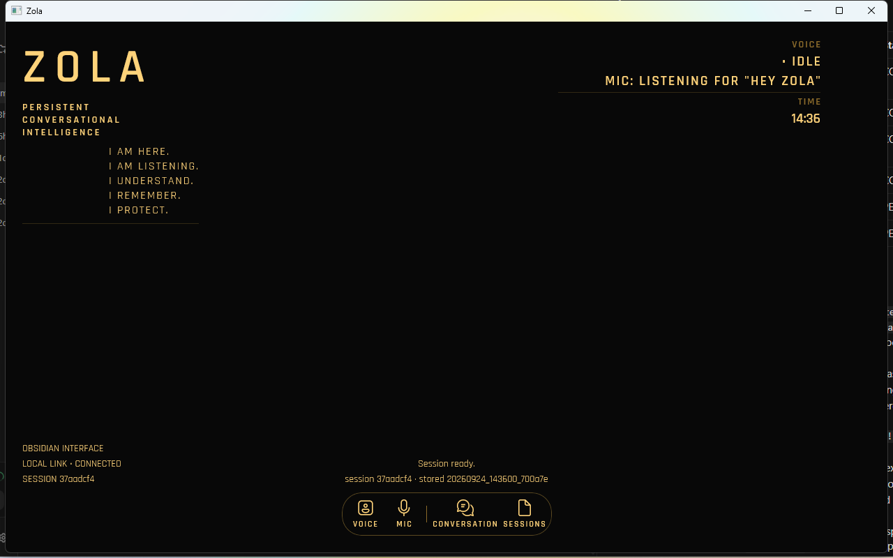
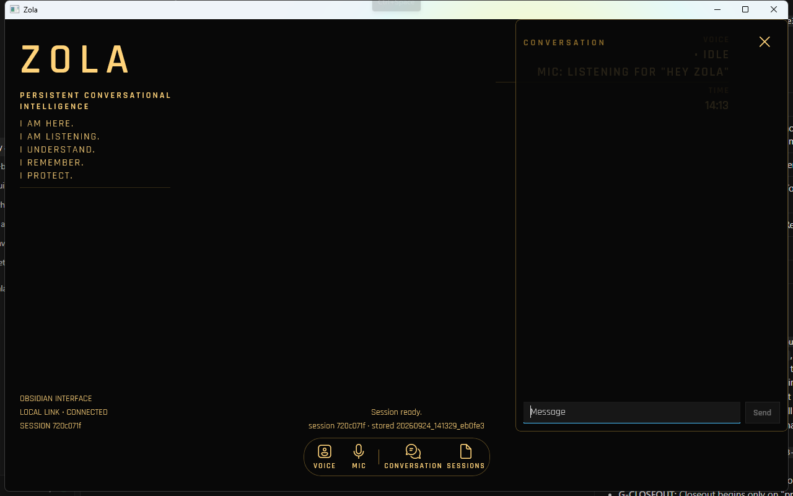
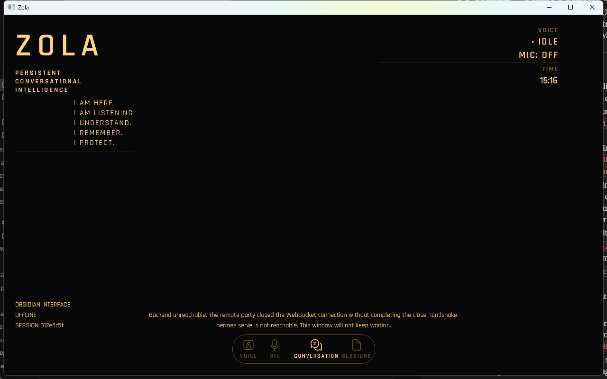

# P3-SHELL Progress — Obsidian Shell

## Branch

- Branch: `p3-shell-obsidian`
- Base SHA: `a03fda5389305f84668e63e437d9ee9f1b27d500` (plan v1.2 commit; branch point)
- Plan v1.2 commit SHA: `a03fda5389305f84668e63e437d9ee9f1b27d500`
- Recorded HEAD before the plan commit: `9c42f409f84233efa8484412442c186da60b129c` (`docs: record P3-STATE merge SHA`), a direct successor of P3-STATE merge `2fb98126eed05561c86b7b3e67ed454b0e7ef331`
- Plan source SHA-256: `8873da7347efaed724c9c8c54189b95ddfb7e33aed43469ae4d8be45c413d451` (matched)
- Prompt: P3-SHELL v1.1

## Phase status

| Phase | Name | Status |
|---|---|---|
| 1 | Plan v1.2, Branch, and Progress Document | COMPLETE |
| 2 | Read and Understand | COMPLETE |
| 3 | Build: Assets, Tokens, and LinkLabel | COMPLETE |
| 4 | Build: Layout Restructure | COMPLETE |
| 5 | Smoke Test | COMPLETE |
| 6 | Closeout | COMPLETE |

## Guardrails summary

- **G-SCOPE:** Tokens, fonts, OFL, `.gitattributes`, font `Content` items, `App.xaml` merge, `LinkLabel` on `ZolaDisplayState`, `MainWindow.xaml` restructure, visual-only `MainWindow.xaml.cs`, plan v1.2, and this progress document. No RPCs, no voice pipeline, no packages, no 3D, no animation.
- **G-ARCH:** The build plan is truth. A conflict that affects a task is a stop.
- **G-PATTERN:** Read every relevant file in full before changing it.
- **G-NOCHANGE:** Handler logic does not change. Only where things are shown may change.
- **G-COMMENT:** One `// P3-SHELL: … — P3-D0X` (XAML: `<!-- P3-SHELL: … — P3-D0X -->`) per logically distinct changed block.
- **G-STOP:** Stop after each phase and wait for that phase's exact proceed message.
- **G-CLOSEOUT:** Closeout begins only on "proceed to closeout".
- **G-LORE-SCOPE:** `ROADMAP.md`, `DESIGN_DECISIONS.md`, and `OPEN_QUESTIONS.md` are out of scope, including closeout.
- **G-NO-CROSS-SCOPE:** Android Zola, Ava, and the P3PRE spike folder are out of scope. Reference PNGs in `zola-assets` are layout and typography only.
- **G-NAMES:** Every Audit 01 §1 `x:Name` stays, same type and handler. `Ctrl+Space` stays on the root `Grid`.
- **G-TOKENS:** Design values live only in `Themes/ZolaTokens.xaml`. No system `ThemeResource` brushes remain.
- **G-HONEST-HUD:** HUD is identity plus voice block, time, session, and link. No ATTENTION, OPTIMAL, ENCRYPTED, CALM, momentum, tone, environment, version, location, Core Systems, or waveform.
- **G-DEPS:** Only the three pre-approved font copy/download commands.

## G-NAMES inventory

### Before (Phase 2)

| x:Name | Type | Handler | Code-behind lines |
|---|---|---|---|
| `ModeButton` | `Button` | `Click` → `OnModeClick` | Content/IsEnabled 336–337 |
| `SessionsButton` | `Button` | `Click` → `OnSessionsToggle` | IsEnabled 637 |
| `StatusText` | `TextBlock` | none | 78, 86, 107, 132, 138, 174, 197, 219, 258, 293, 310, 317, 353, 372, 387, 397, 431, 492, 510, 540, 696, 709, 740, 759, 773 |
| `DetailText` | `TextBlock` | none | 79, 120, 526, 543, 664 |
| `VoiceStateText` | `TextBlock` | none | 334 |
| `MicIndicatorText` | `TextBlock` | none | 335 |
| `TranscriptScroll` | `ScrollViewer` | none | 849–850 (`ScrollToEnd`) |
| `Transcript` | `StackPanel` | none | 604, 616, 840 |
| `SessionPanel` | `Border` | none | 653 Visible, 680 Collapsed |
| `EmptySessionsText` | `TextBlock` | none | 833 |
| `SessionList` | `ListView` | `ItemClick` → `OnSessionItemClick` | 831, 834 |
| `NewSessionButton` | `Button` | `Click` → `OnNewSessionClick` | 638 |
| `CloseSessionsButton` | `Button` | `Click` → `OnCloseSessionsClick` | none (handler only) |
| `Composer` | `TextBox` | `TextChanged` → `UpdateChrome` (60); `PreviewKeyDown` → `OnComposerKeyDown` (61) | 139, 145, 154, 562, 632–633, 681, 760 |
| `MicButton` | `Button` | `Click` → `OnMicClick` | 338–339 |
| `SendButton` | `Button` | `Click` → `OnSendClick` | 633 |
| `CancelButton` | `Button` | `Click` → `OnCancelClick` | 373, 634 |

Root `Grid` `KeyboardAccelerator` Key=`Space` Modifiers=`Control` → `OnVoiceHotkey` (232).

### After (Phase 4)

| x:Name | Type | Handler | Code-behind lines |
|---|---|---|---|
| `ModeButton` | `Button` | `Click` → `OnModeClick` | IsEnabled 379 |
| `SessionsButton` | `Button` | `Click` → `OnSessionsToggle` | IsEnabled 682 |
| `StatusText` | `TextBlock` | none | same writers as Before |
| `DetailText` | `TextBlock` | none | same writers as Before |
| `VoiceStateText` | `TextBlock` | none | 374 |
| `MicIndicatorText` | `TextBlock` | none | 375 |
| `TranscriptScroll` | `ScrollViewer` | none | `ScrollToEnd` |
| `Transcript` | `StackPanel` | none | bubble factory / `ClearTranscript` |
| `SessionPanel` | `Border` | none | Visible 701; Collapsed 728 |
| `EmptySessionsText` | `TextBlock` | none | `BindSessions` |
| `SessionList` | `ListView` | `ItemClick` → `OnSessionItemClick` | `BindSessions` |
| `NewSessionButton` | `Button` | `Click` → `OnNewSessionClick` | IsEnabled 683 |
| `CloseSessionsButton` | `Button` | `Click` → `OnCloseSessionsClick` | none (handler only) |
| `Composer` | `TextBox` | `TextChanged` → `UpdateChrome`; `PreviewKeyDown` → `OnComposerKeyDown` | enablement / placeholder / focus on overlay open 977 |
| `MicButton` | `Button` | `Click` → `OnMicClick` | IsEnabled 380 |
| `SendButton` | `Button` | `Click` → `OnSendClick` | IsEnabled 677 |
| `CancelButton` | `Button` | `Click` → `OnCancelClick` | IsEnabled 678; Visibility 679 |

Root `Grid` (`RootGrid`) `KeyboardAccelerator` Key=`Space` Modifiers=`Control` → `OnVoiceHotkey` (270). Escape → `OnEscapeKey` (999).

New names (required):

| x:Name | Type | Handler |
|---|---|---|
| `PresenceHost` | `Grid` | none |
| `LinkText` | `TextBlock` | none (`ApplyVoiceChrome` 378) |
| `SessionText` | `TextBlock` | none (`UpdateSessionHud` 1016 only) |
| `TimeText` | `TextBlock` | none (clock) |
| `ModeButtonLabel` | `TextBlock` | none (`ApplyVoiceChrome` 376) |
| `MicButtonLabel` | `TextBlock` | none (`ApplyVoiceChrome` 377) |
| `ConversationButton` | `Button` | `Click` → `OnConversationClick` |
| `ConversationOverlay` | `Border` | none |

Extra names for layout/measure/focus: `RootGrid`, `DockHost`, `NoticeHost`.

## Phase 2 understanding

### 1. Name inventory

See the Before table above. Matches Audit 01 §1.

### 2. Visual literals (KC5)

`MainWindow.xaml`:
- `Style="{StaticResource TitleTextBlockStyle}"` (26), `SubtitleTextBlockStyle` (56)
- `BorderBrush="{ThemeResource DividerStrokeColorDefaultBrush}"` (49)
- `Width="300"` on `SessionPanel` (49); `Padding="12"` (49); `Padding="0,4"` in the item template (62)
- `Opacity="0.8"` on `DetailText` and `EmptySessionsText`; `Opacity="0.7"` on last-activity
- `MinWidth="88"` on Mic/Send/Cancel; `MaxHeight="120"` on Composer
- Initial `Text="Idle"` and `Text="Mic: off"` (KC3)
- Grid `Padding="16"` `RowSpacing="12"` (one-off layout; G-TOKENS allows those)

`MainWindow.xaml.cs`:
- `AppWindow.Resize(960, 720)` (40)
- Bubble `FontWeight` SemiBold (590, 611); `Padding = 12`; `CornerRadius = 8`; `MaxWidth = 720` (601, 622)
- `BubbleBrush`/`BrushOr` theme keys plus fallbacks (859–888): `SystemFillColorCriticalBackgroundBrush` `#FFD6D6`, `SystemFillColorCautionBackgroundBrush` `#FFECC`C, `AccentFillColorDefaultBrush` `#D6E4FF`, `CardBackgroundFillColorDefaultBrush` `#F4F4F4`

### 3. Visibility and focus (KC4 / KC6)

Visibility:
- `SessionPanel` Visible `OnSessionsToggle` 653; Collapsed `HideSessions` 680
- `EmptySessionsText` / `SessionList` in `BindSessions` 833–834
- Live-bubble badge Collapsed/Visible in `StyleLive` 577/581 and `OnMessageStarted` 419

Focus:
- `HideSessions` 681 `Composer.Focus(FocusState.Programmatic)` — **remove** per KC6
- No other `Focus` calls

`ScrollToEnd` (847–850): `OnMessageStarted` 433, `OnMessageDelta` 450, `StyleLive` 584, `AddBubble` 625. On a collapsed overlay it is a no-op. Opening the conversation overlay must call `ScrollToEnd()` after it is visible (Phase 4 / KC4).

### 4. Minimum size API

Windows App SDK 2.5.1 `Microsoft.UI.Windowing.OverlappedPresenter` supports:
- `PreferredMinimumWidth`
- `PreferredMinimumHeight`

Also `PreferredMaximumWidth` / `PreferredMaximumHeight` (not used). This window already uses `AppWindow.Resize`. Phase 4 sets:

```
if (AppWindow.Presenter is OverlappedPresenter presenter)
{
    presenter.PreferredMinimumWidth = 900;
    presenter.PreferredMinimumHeight = 640;
}
```

No `AppWindow.Changed` clamp needed.

### 5. Dock glyphs

`C:\Windows\Fonts\SegoeIcons.ttf` is present (`segmdl2.ttf` also present). Use **Segoe Fluent Icons** as `ZolaIconFont`.

| Button | Glyph | Code point |
|---|---|---|
| Voice/Text (`ModeButton`) | Switch | `E8D4` |
| Mic (`MicButton`) | Microphone | `E720` |
| Conversation | Comment | `E8F2` |
| Sessions | Library | `E8A5` |
| Cancel | Cancel | `E711` |

### 6. `LinkLabel`

Add `string LinkLabel` to the `ZolaDisplayState` record (after `PresenceMode`). Store `sessionReady` from `UpdateWindowFacts` in a new field `_sessionReady` (the parameter is not stored today; it is only passed to `SetCaptureGate`). In `Recompute`, first match, after the existing button/mode work, before constructing the record:

1. `_unreachable \|\| !_backendReachable` → `"OFFLINE"`
2. `_switchInFlight \|\| _historyPending` → `"LOCAL LINK • RECONNECTING"`
3. `_sessionReady` → `"LOCAL LINK • CONNECTED"`
4. else → `"LOCAL LINK • CONNECTING"`

`InitialState` gets `"OFFLINE"`. Extend `DisplayStateLineFormat` to include `link=`. Those four cases use only facts the model already receives.

### 7. Flags

None that block Phase 3. Note: `P3-D11`'s layout list still says "VOICE, MIC, divider, TIME"; `P3-D06` v1.2 and this prompt's Phase 4 use one VOICE header plus two value lines. Follow `P3-D06` v1.2.

## Discrepancies

Discrepancies: none at start. Plan v1.2 `git diff` showed only the voice-block and link rows (`P3-D06`), the conversation-tokens bullet (`P3-D08`), the dock-labels note (`P3-D11`), and the version footer. Phase 2: no blocker. `sessionReady` must become a stored field for `LinkLabel`. `P3-D11` still names a separate MIC header; execution follows `P3-D06` v1.2.

## Phase 3 build

Fonts SHA-256 match the plan (regular `F0BA67D6…34D2E`, semibold `5FD51C13…EB0CD`). `OFL.txt` is SIL OFL 1.1 naming Indian Type Foundry. All three files are in the unpackaged output `Fonts\` folder.

`.gitattributes` marks `*.ttf` and `*.glb` binary. `Zola.Client.csproj` copies `Fonts\*.ttf` and `Fonts\OFL.txt` as `Content`. `Themes/ZolaTokens.xaml` holds K7 colours, S=2 styles, geometry, dock/panel styles, and `ZolaIconFont`. `App.xaml` merges it after `XamlControlsResources`.

`ZolaDisplayState` record gained `LinkLabel` only. `InitialState` is `"OFFLINE"`. `Recompute` first-match: OFFLINE / RECONNECTING / CONNECTED / CONNECTING. `_sessionReady` is stored from `UpdateWindowFacts`. Existing fields and label tables are unchanged. Display log now includes `link=`.

`dotnet build … -r win-x64` 0 warnings. Client pid 16964 launched at 14:03 with the Phase 1 layout unchanged. First new log line: `voice="Idle" mic="Mic: off" mode=Idle link="LOCAL LINK • CONNECTED"`.

## Phase 4 build

`MainWindow.xaml` is the one-cell obsidian shell: `PresenceHost` empty, HUD (identity / voice+time / session+link), notice line, dock, conversation overlay, sessions overlay. `RequestedTheme="Dark"`. `Ctrl+Space` stays on the root grid. Escape closes the open panel. `Text="Idle"` and `Text="Mic: off"` are gone.

`ApplyVoiceChrome` assigns upper-case HUD/dock labels and `LinkText`; button `IsEnabled` is unchanged. `UpdateChrome` shows `CancelButton` only while a turn runs, then calls `UpdateSessionHud()`. `HideSessions` no longer focuses `Composer`. Opening conversation collapses sessions (via `HideSessions`), sizes the overlay, focuses `Composer` if enabled, and `ScrollToEnd()`. Opening sessions collapses the overlay first.

Dock measure with Cancel visible and `LISTENING` on the mic label (fits in 900):

| | width (px) |
|---|---|
| total (`DockHost`) | 373 |
| `ModeButton` | 48 |
| `MicButton` (`LISTENING`) | 64 |
| `ConversationButton` | 93 |
| `SessionsButton` | 61 |
| `CancelButton` | 48 |

G-TOKENS search of `MainWindow.xaml(.cs)`: no `#RRGGBB`, no `ThemeResource`, no font-size or `MaxWidth`/`Padding`/`CornerRadius` literals. Exceptions:

- Grid `Height="Auto"` / `"*"` and `Width="*"` / `"Auto"` (star/auto, not design values).
- Dock `Glyph="&#xE8D4;"` and siblings (icon identities).
- `Background="Transparent"` on `SessionList` (no-fill).
- WinUI `TextBox` default template still draws a system accent caret/underline on `Composer`; `ZolaComposerStyle` sets font, size, foreground, surface, and border.

G-HONEST-HUD search: no ATTENTION, OPTIMAL, ENCRYPTED, CALM, momentum, tone, environment, version, location, Core Systems, or waveform.

`SessionText` is written only by `UpdateSessionHud()`. `Canvas.ZIndex` uses `ZolaLayerPresence` 0, `ZolaLayerHud` 10, `ZolaLayerNotice` 20, `ZolaLayerDock` 30, `ZolaLayerPanel` 40.

`dotnet build … -r win-x64` 0 warnings. Screenshots at 1280×800:





WinUI `CharacterSpacing` is not included in measure, so right-aligned tracked text can paint past its slot. The HUD right gutter is 72 + 24 pad to keep VOICE/TIME on-screen. Overlay fill is 0.88, so the HUD can show through it.

### Phase 4 corrections (before smoke)

Dock measurement probe removed from `MainWindow.xaml.cs` (`MeasureDockOnce`, `WriteDockMeasure`, `_dockMeasured`, `DockMeasureLineFormat`, `DockMeasureLogFile`, and the `OnRootLoaded` call). Recorded widths above stay.

Identity block now matches `zola-assets/android_hud_reference.png` for layout only (`P3-D07`): tagline is three lines (`PERSISTENT` / `CONVERSATIONAL` / `INTELLIGENCE`); mantra uses `ZolaMantraIndent` **124** (left), leaving the waveform slot empty; divider stays under the mantra. `P3-SHELL_1280_closed.png` replaced after rebuild (0 warnings).

## Smoke test

### Part A

| # | Result | Evidence |
|---|---|---|
| A1 | PASS | `P3-SHELL_smoke_A1.png` 1280×800. Typeface judged in Part B. |
| A2 | PASS | HUD TextBlocks only: identity, VOICE + mic, TIME, OBSIDIAN INTERFACE, `LOCAL LINK • CONNECTED`, SESSION. |
| A3 | PASS | `15:09:59` `voice="Text mode" mode=Thinking` → `15:10:01` `mode=Idle`. No `Speaking`. Re-run after focus fix. `P3-SHELL_smoke_A3.png`. |
| A4 | PASS | Esc while Thinking; idle `15:10:21`; reopen shows lighthouse user bubble + complete assistant. `P3-SHELL_smoke_A4.png`. |
| A5 | PASS | `P3-SHELL_smoke_A5_900x640.png` 900×640. |
| A6 | PASS (developer-checked) | Overlay open at 900×640, 1280×800, 1920×1080. Window spanned two monitors, so `P3-SHELL_smoke_A6_1920x1080.png` captured the primary screen only. Developer confirmed the window rendered correctly. No re-shoot. |
| A7 | PASS | Esc collapsed the overlay (`TranscriptScroll` / `Composer` not visible). |
| A8 | PASS | Cancel missing before send; streaming `vis=True en=True`; after click Cancel missing, UIA `Interrupted`, idle `15:10:36`. `P3-SHELL_smoke_A8.png`. |
| A9 | PASS | One panel at a time; Esc closes the open panel. Ctrl+Space after each close: `Listening` / `Mic: recording`. |
| A10 | PASS | New session then resume older stored session; prior You/Zola turns loaded. `P3-SHELL_smoke_A10.png`. |
| A11 | PASS | Ctrl+Space from Composer and from presence both logged `Listening`. |
| A12 | PASS | `SetWindowPos` 600×400 → actual 900×640. Dock inside window; no named HUD overlap. `P3-SHELL_smoke_A12.png`. |
| A13 | PASS (developer) | No `.lnk` on Desktop/Start Menu for Cursor. Developer relaunched from their usual shortcut. |
| A14 | PASS | After typed Enter and Send, `Composer.HasKeyboardFocus=True`; second message typed with no click. `P3-SHELL_smoke_A14.png`. |
| A15 | PASS | Overlay closed mid-reply: composer not focused at idle `15:11:25`. Ctrl+Space with overlay closed: `Listening`, composer not focused. `P3-SHELL_smoke_A15.png`. |

### Part B

Developer reported B1–B7 all passed (typeface, voice combined smoke, hidden-transcript voice, close during spoken turn, min-size drag, Part A screenshot review, A13 relaunch).

### Part C

Stopped serve PID 19168 (listener on `127.0.0.1:58413`, the port client 2816 was connected to) and parent 24424 (`python -m hermes_cli.main -p zola serve --isolated`). Did not stop `Zola.Client`.

- UIA: `LinkText` = `OFFLINE`; `SessionText` stayed `SESSION 012e5c5f`; `Composer`, `MicButton`, `ModeButton` disabled; window still open (pid 2816).
- Log: `2026-09-24T15:17:06.4106950-07:00 P3-STATE: fact unreachable=true` then `voice="Idle" mic="Mic: off" mode=Dormant link="OFFLINE"`.



Smoke scripts stayed in `%TEMP%\p3shell-smoke\` (outside the repo). Other `git status` entries are the Track 2 implementation from Phases 3–4, not smoke artifacts.

Developer: `smoke test passed. proceed to closeout.` (2026-09-24).

## Closeout

- Tests: N/A (no automated suite).
- `dotnet build windows-client/Zola.Client/Zola.Client.csproj -r win-x64`: 0 warnings, 0 errors.
- `hermes-agent` `git status` clean at `345cd2b057a452236de401d3534b8502a7465e8d`.
- Fonts SHA-256: regular `F0BA67D6EF91BCFF8B0E43A051F7483DD83EBFCADE19880CD15DF29890234D2E`; semibold `5FD51C1334CAFD3654059B0EE61AA470088A70E4637A9CFC0274557C751EB0CD`. `OFL.txt` is SIL OFL 1.1, Indian Type Foundry.
- Nothing from `zola-assets` other than the two copied fonts, and nothing from `zola-spikes`, is staged.
- No lore file updates (G-LORE-SCOPE).
- Overlay width tokens: `ConversationOverlayMaxWidth` = 440, `ConversationOverlayMaxFraction` = 0.45.

### Final file list

New:
- `.gitattributes`
- `windows-client/Zola.Client/Fonts/rajdhani_regular.ttf`
- `windows-client/Zola.Client/Fonts/rajdhani_semibold.ttf`
- `windows-client/Zola.Client/Fonts/OFL.txt`
- `windows-client/Zola.Client/Themes/ZolaTokens.xaml`
- `zola-architecture/lore/prompts/progress/P3-SHELL_Progress.md`
- `zola-architecture/lore/prompts/progress/P3-SHELL_1280_closed.png`
- `zola-architecture/lore/prompts/progress/P3-SHELL_1280_open.png`
- `zola-architecture/lore/prompts/progress/P3-SHELL_smoke_A1.png`
- `zola-architecture/lore/prompts/progress/P3-SHELL_smoke_A3.png`
- `zola-architecture/lore/prompts/progress/P3-SHELL_smoke_A4.png`
- `zola-architecture/lore/prompts/progress/P3-SHELL_smoke_A5_900x640.png`
- `zola-architecture/lore/prompts/progress/P3-SHELL_smoke_A6_900x640.png`
- `zola-architecture/lore/prompts/progress/P3-SHELL_smoke_A6_1280x800.png`
- `zola-architecture/lore/prompts/progress/P3-SHELL_smoke_A6_1920x1080.png`
- `zola-architecture/lore/prompts/progress/P3-SHELL_smoke_A8.png`
- `zola-architecture/lore/prompts/progress/P3-SHELL_smoke_A10.png`
- `zola-architecture/lore/prompts/progress/P3-SHELL_smoke_A12.png`
- `zola-architecture/lore/prompts/progress/P3-SHELL_smoke_A14.png`
- `zola-architecture/lore/prompts/progress/P3-SHELL_smoke_A15.png`
- `zola-architecture/lore/prompts/progress/P3-SHELL_smoke_C.png`

Modified:
- `windows-client/Zola.Client/App.xaml`
- `windows-client/Zola.Client/MainWindow.xaml`
- `windows-client/Zola.Client/MainWindow.xaml.cs`
- `windows-client/Zola.Client/Zola.Client.csproj`
- `windows-client/Zola.Client/ZolaDisplayState.cs`

Already on `main` (Phase 1): `zola-architecture/lore/build-plans/PHASE3_BUILD_PLAN.md` (plan v1.2).

### Exit criteria (PHASE3_BUILD_PLAN.md Track 2)

- ✅ MET — Audit 01 §1 `x:Name`s and handlers match the Before/After G-NAMES tables; `Ctrl+Space` stays on `RootGrid`.
- ✅ MET — Audit 01 §2 behaviours held in HUMAN-RUN smoke (Parts A, B, C).
- ✅ MET — No colour, font family, or font size is set outside `ZolaTokens.xaml` (search of `MainWindow.xaml(.cs)`).
- ✅ MET — G-HONEST-HUD search: no ATTENTION, OPTIMAL, ENCRYPTED, CALM, momentum, tone, environment, version, location, Core Systems, or waveform.
- ✅ MET — Font SHA-256 matches the plan; `OFL.txt` committed alongside the two `.ttf` files.
- ✅ MET — `hermes-agent` clean at `345cd2b057a452236de401d3534b8502a7465e8d`.
- ✅ MET — `dotnet build … -r win-x64` passed with 0 warnings.
- ✅ MET — HUMAN-RUN smoke passed (2026-09-24): typeface, Phase 2 combined smoke, overlay, Cancel, sessions, kill-serve OFFLINE, min-size, overlay-open sizes. Overlay width is `min(ConversationOverlayMaxWidth 440, ConversationOverlayMaxFraction 0.45 × window)`.

Track 1 carried ⚠️ (XAML initial `Text="Idle"` / `Text="Mic: off"`): **resolved** (KC3). Those attributes are gone.

### SHAs

- Plan v1.2 commit on `main`: `a03fda5389305f84668e63e437d9ee9f1b27d500`
- Implementation commit: `021210e71809dc1fb67ac644a7a40685219f28aa`
- Merge SHA on `main`: `b8bf6a15c8b806bca0fea499dbcfce0535e92932`
